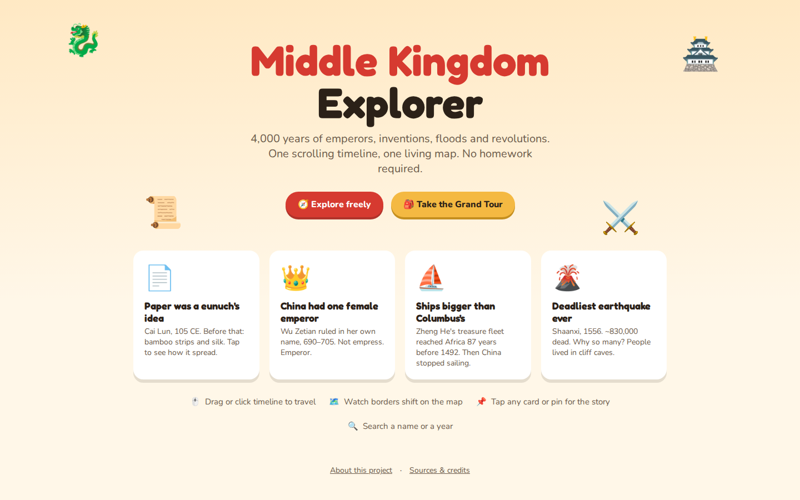
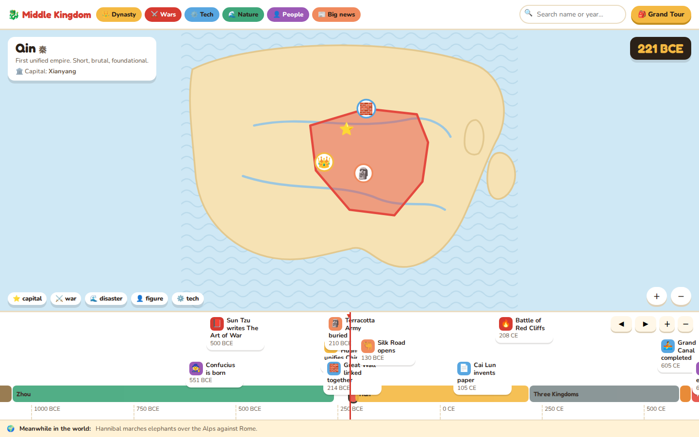
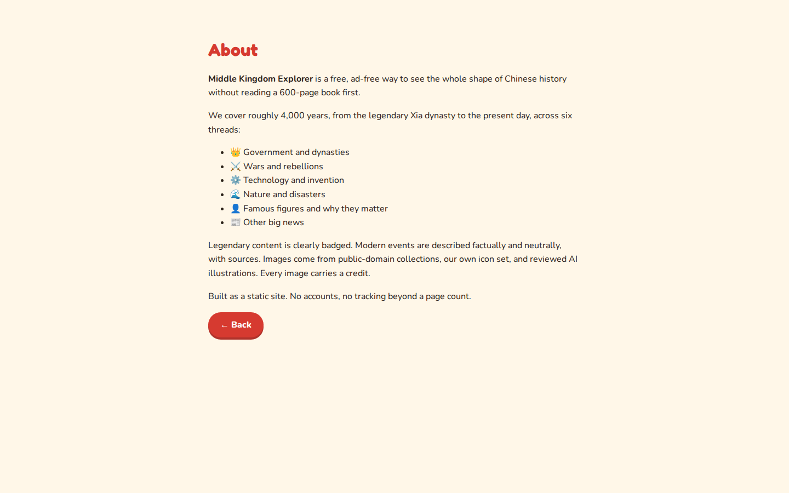
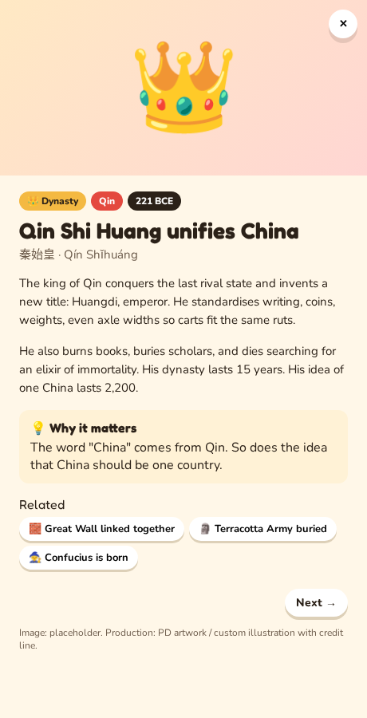
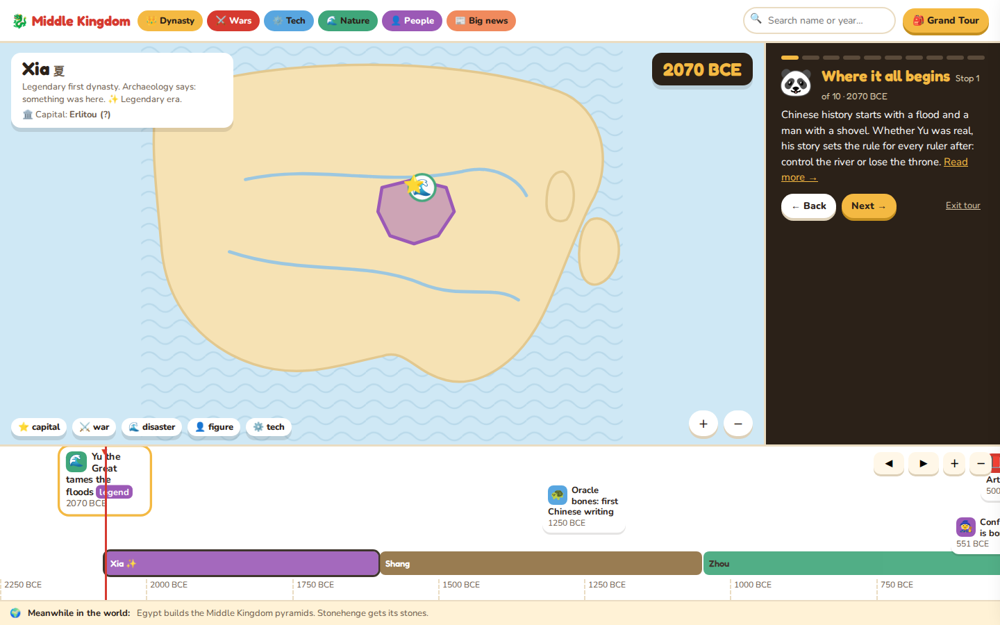
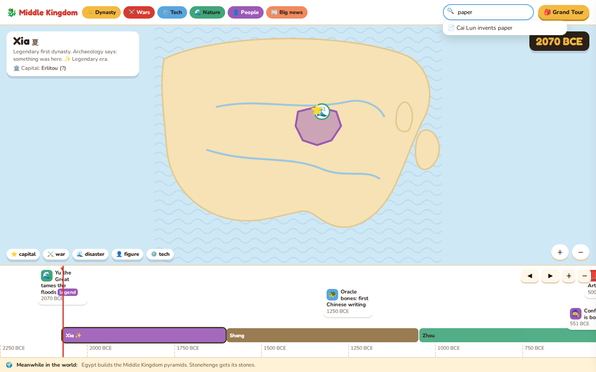
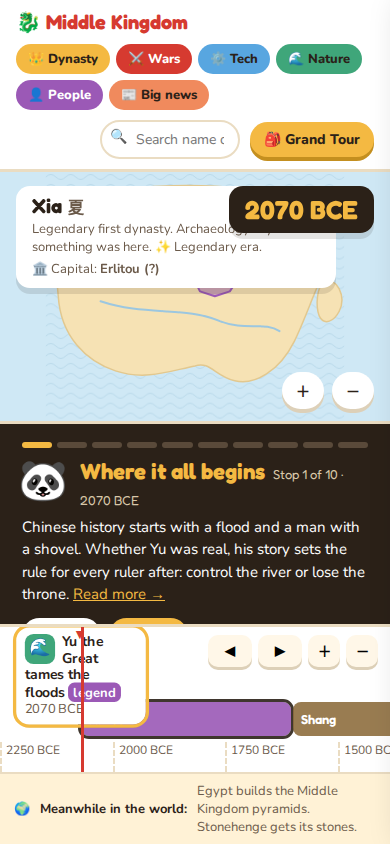

# Storyboard — Middle Kingdom Explorer

> Live reference: open `./mockup.html` in a browser.
> Screenshots of each screen live in `./images/`.

## Screen 1 — Landing

- **Purpose:** first impression and entry point. Tell a stranger what this is in one glance and give them exactly two ways in.
- **Key elements:** hero (name, tagline, floating dragon/lantern decorations), two primary buttons (Explore freely, Take the Grand Tour), four teaser cards ("Did you know?"), how-to strip (four one-line hints), footer links (About, Sources & credits).
- **User actions:** click **Explore freely** → Screen 2 at default year (221 BCE, Qin). Click **Take the Grand Tour** → Screen 2 with tour started at stop 1. Click any teaser card → Screen 2 with that event's detail open (Screen 4) over it. Click **About this project** → Screen 3. Click **Sources & credits** → toast (not built in v1; real app links to About's credits section).
- **Transitions:** → Screen 2 (two ways), → Screen 3, → Screen 4 (via teaser).
- **States:** default only. No empty/error state — this screen has no dynamic data.

## Screen 2 — Explore (timeline + map)

- **Purpose:** the core screen. Show where China was and what happened at any point across 4,000 years, and let the user travel through time.
- **Key elements:** topbar (logo/home, 6 category filter chips, search box, Grand Tour button), map pane (illustrated territory that morphs per era, capital star, event pins, era label card, year badge, legend, zoom controls), timeline pane (era color bands, event cards positioned by year, playhead, year ticks, pan/zoom buttons, scrollbar), "Meanwhile in the world" strip.
- **User actions:** drag or wheel-scroll the timeline → playhead and map update live. Click anywhere on the timeline → jump to that year. Click an era band → jump to its start. Click an event card or a map pin → Screen 4 opens over this screen (map/timeline stay visible, dimmed). Toggle a category chip → timeline and map pins filter to selected categories (at least one stays on). Type in search → dropdown of matches (Screen 6). Click Grand Tour → Screen 5 docks beside the map. Click ◀ ▶ or +/− → pan/zoom the timeline. Arrow keys → move playhead ±25 years. Click logo → Screen 1.
- **Transitions:** → Screen 4 (card/pin click), → Screen 5 (Grand Tour), → Screen 6 (search typing), → Screen 1 (logo).
- **States:** **default** (as shown, Qin era). **Empty** — all-but-one category filtered off and the current era has none of that category: map shows "No events in this era for the selected categories. Turn on more chips above." **Mobile** — see Screen 7, map stacks above timeline, legend hidden.

## Screen 3 — About

- **Purpose:** build trust. Explain scope, the six content categories, and the image-sourcing/licensing policy from PRD F9.
- **Key elements:** title, mission paragraph, category list (Dynasty, Wars, Tech, Nature, People, Big news), sourcing/credits paragraph, Back button.
- **User actions:** click **Back** → Screen 1.
- **Transitions:** → Screen 1.
- **States:** default only, static content.

## Screen 4 — Event detail

- **Purpose:** the two-minute read. Everything the PRD's F4 acceptance criteria require for one event.
- **Key elements:** illustration area with credit line, category/era/year badges (+ Legend badge when applicable), title, hanzi + pinyin, 2–3 body paragraphs, "Why it matters" callout, related-event chips, Prev/Next within category, close (×).
- **User actions:** click a related chip → reloads this panel for that event (map/timeline jump underneath). Click Prev/Next → same-category neighbor. Click × / press Esc / click outside → closes back to Screen 2. Opening this panel updates the URL hash so it is shareable (PRD flow 7).
- **Transitions:** → Screen 4 again (related/prev/next, same screen re-rendered), → Screen 2 (close).
- **States:** **default** (shown, Qin Shi Huang). **Deep-link error** — `#event=<unknown-id>` shows a toast ("Event not found. Showing the timeline instead.") and falls back to Screen 2 instead of a broken panel.

## Screen 5 — Grand Tour (docked panel)

- **Purpose:** guided path for a newcomer who doesn't know where to start. Never covers the map — this was an explicit fix after the first mockup review.
- **Key elements:** dark panel docked to the right of the map (stacks below map on narrow viewports, see Screen 7), progress dots (10 shown in mockup, 20 in production per PRD F5), guide mascot, stop title + "Stop N of X · year", 3–4 sentence narration, "Read more →" link, Back/Next, Exit tour.
- **User actions:** **Next**/**Back** → advances/retreats a stop; map morphs and timeline scrolls to that stop's year, matching event glows. **Read more** → opens Screen 4 without leaving tour state. **Exit tour** → closes panel, drops user into free explore (Screen 2) at the current year. Finishing the last stop → completion toast, panel closes.
- **Transitions:** → Screen 4 (Read more, tour stays active behind it), → Screen 2 (Exit or Finish).
- **States:** **default** (mid-tour, shown). **Resumed** — reopening Grand Tour restores the last stop from localStorage instead of starting at stop 1.

## Screen 6 — Search results

- **Purpose:** fast jump to a known name or year without scrolling.
- **Key elements:** search input (in topbar), dropdown of up to 6 matches, each with icon + label; year-only queries offer a "Jump to <year> (<era>)" entry.
- **User actions:** type → dropdown filters live. Click a result → event result opens Screen 4; year result moves the playhead on Screen 2. Click outside or Esc → dropdown closes, query cleared.
- **Transitions:** → Screen 4 or → Screen 2 (playhead jump), both dismiss the dropdown.
- **States:** **default** (matches shown). **Empty** — no match shows a single "No match" row.

## Screen 7 — Explore (mobile, 390px)

- **Purpose:** confirm the core screen and Grand Tour survive down to phone width per PRD non-functional requirement (min viewport 360px).
- **Key elements:** topbar chips wrap to two rows, search and Grand Tour button wrap below, map pane shrinks, legend hidden (PRD-noted mobile simplification), Grand Tour panel stacks under the map instead of beside it, timeline unchanged.
- **User actions:** same as Screen 2/5, touch-equivalent (tap for click, swipe for drag/wheel).
- **Transitions:** same graph as Screen 2 and Screen 5.
- **States:** default only shown; same empty/error states as Screens 2, 4, 6 apply at this width. **Known gap for build phases:** tour panel at this width leaves the map very short (~100px) — worth a mobile-specific layout (e.g. tour as a bottom sheet, or map/tour tabs) rather than literal stacking; flagged for a design pass, not blocking S4.

## Journey Summary

1. **First visit → explore an event.** Screen 1 → click *Explore freely* → Screen 2 (Qin, 221 BCE) → drag timeline to Tang → click *Wu Zetian becomes emperor* card → Screen 4 → click related chip *Gunpowder recorded* → Screen 4 (re-rendered) → Esc → back to Screen 2.
2. **Grand Tour end to end.** Screen 1 → *Take the Grand Tour* → Screen 2 + Screen 5 at stop 1 (Xia, legendary) → Next ×N through all stops (map morphs, timeline scrolls each time) → Finish → completion toast → Screen 2 free explore.
3. **Search by name.** Screen 2 → type "paper" in search → Screen 6 dropdown → click *Cai Lun invents paper* → Screen 4, map/timeline jumped to 105 CE.
4. **Search by year.** Screen 2 → type "1368" → Screen 6 shows *Jump to 1368 CE (Ming)* → click → playhead moves, no panel opens.
5. **Filter to one category.** Screen 2 → toggle off all but *Wars* → timeline/map show only war events and pins → attempt to toggle off the last chip → blocked with a toast, at least one stays on.
6. **Map pin.** Screen 2 → click a pin on the map (e.g. Terracotta Army) → Screen 4 opens for that event.
7. **Share a moment.** Screen 4 open on an event → URL now contains `#event=<id>` → copy, open in new tab → same Screen 4 restores directly. If the id is stale/unknown → error toast, falls back to Screen 2 (see Screen 4 states).
8. **Mobile pass.** Screen 1 at 390px → *Explore freely* → Screen 7 → *Grand Tour* → tour stacks under map, still usable → Exit → Screen 7 free explore.
9. **About.** Screen 1 → *About this project* → Screen 3 → *Back* → Screen 1.
